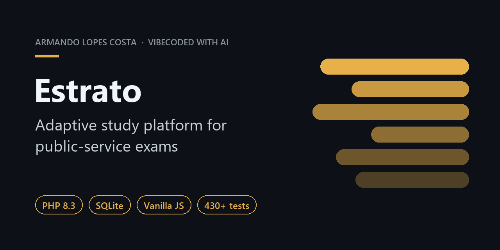
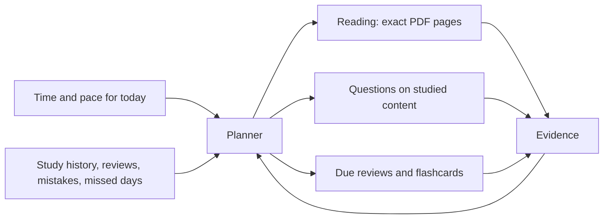

  

# Estrato

> An adaptive study platform for public-service exams. Open it, get today's best route, and study.

**Status:** in daily use · **Type:** personal project · **Built with:** AI coding agents

---

## Why

Brazilian public-service exams (*concursos*) reward whoever studies the right thing every single day. The hard part is rarely motivation. It's deciding what to read, which questions to practice, what to review and how to recover after a missed day. Estrato makes that decision so the time goes into studying, not into managing the study.

## Highlights

- **Adaptive daily planner.** Rebuilds the day from available time, study pace, what has already been read, overdue reviews, mistakes, missed days, postponed blocks and how close the exam is.
- **Exposure ≠ memory ≠ mastery.** Reading a PDF never counts as knowing it. Pre-tests are labeled and never inflate mastery.
- **Syllabus-linked questions.** Unlocked only for content already studied. Historical exam-board incidence helps prioritize, but is never presented as a probability.
- **Built-in PDF reader.** Opens the exact page range the planner assigned, with reading-time estimates that learn from the student's own pace.
- **Reviews, flashcards, error log and analytics.** Works on desktop, tablet and phone, in light and dark mode.

## How it works

Every action produces evidence, and only the right kind of evidence moves each signal: reading moves exposure, correct answers move mastery, and postponing a block never counts as studying it.

## Engineering

- **430+ automated tests** covering the planner, questions, PDFs, postponements, reviews and time estimates
- **Mutation testing** on critical invariants: if a rule is broken on purpose, a test must fail
- **Release gate:** nothing ships unless the full test battery is green
- **Read-only smoke tests** in production after every release

## Stack

`PHP 8.3` · `SQLite` · `HTML` · `CSS` · `vanilla JavaScript`. No framework.

## How it was built

Vibecoded by a lawyer, pairing with AI coding agents (Claude Code, OpenAI Codex and others) for planning, implementation, adversarial review and testing.

## Source code

This repository is a public showcase. The source code, study data and course materials are private.

---

  Made by <a href="https://github.com/armanderaa">Armando Lopes Costa</a> · <a href="https://www.linkedin.com/in/armando-lopes-costa-4a1b9a1bb/">LinkedIn</a>

